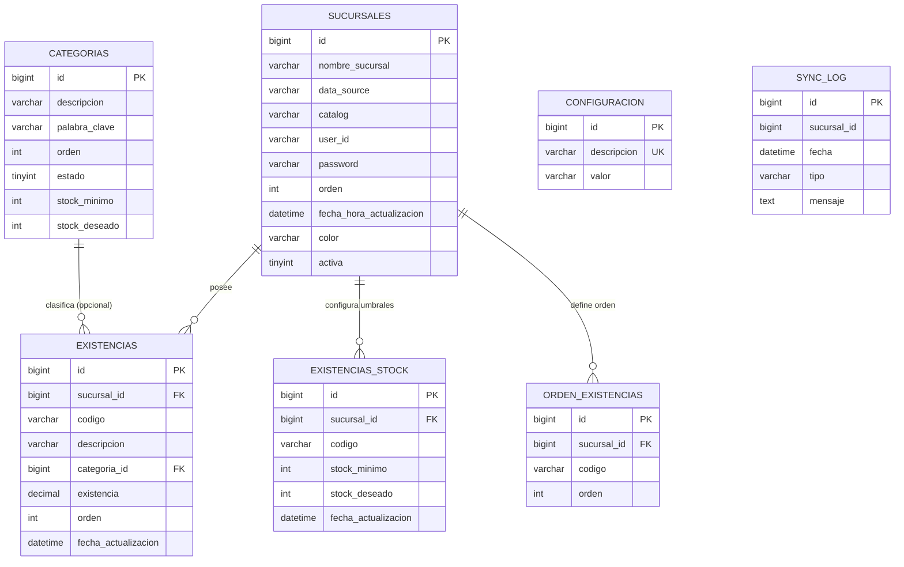

# Manual de Arquitectura y Documentación Técnica - Dalmendra 2.0

## 1. Visión General del Proyecto

**Dalmendra 2.0** es una aplicación de escritorio desarrollada con **Java 21** y **JavaFX**. Su objetivo primordial es servir como un **monitor de existencias en tiempo real multisucursal** para negocios gastronómicos / puntos de venta (diseñado para integrarse nativamente con el motor de base de datos de sistemas POS como Soft Restaurant).

### 1.1. El Problema que Resuelve
En un negocio gastronómico con múltiples sucursales físicas:
- Las existencias en el sistema de almacén central solo se descuentan de forma formal una vez cerrado el turno o cheque.
- Durante el servicio activo (en tiempo real), los comensales realizan pedidos que se registran en "cheques temporales / abiertos".
- Dalmendra extrae la existencia física del almacén y le **resta en vivo los insumos comprometidos en ventas abiertas no canceladas**:
  $$\text{Existencia Neta} = \text{Existencia en Almacén (idalmacen = 3)} - \sum (\text{Cantidad Vendida} \times \text{Receta Insumo})$$
- Consolida esta información en una base de datos local rápida (MySQL), clasifica los insumos por categorías mediante palabras clave, colorea advertencias de stock (mínimo y deseado) y transmite los datos en formato JSON hacia un backend web (Laravel).

---

## 2. Tecnologías y Dependencias

- **Lenguaje:** Java 21 LTS (soporte para Records, Switch Expressions, HttpClient nativo).
- **Framework de Interfaz Gráfica:** JavaFX 21.0.2 (`javafx-controls`, `javafx-fxml`).
- **Base de Datos Local:** MySQL 8.x (mediante `mysql-connector-j` 8.2.0).
- **Base de Datos Externa (Sucursales):** Microsoft SQL Server 2012+ (mediante `mssql-jdbc` 13.4.0.jre11).
- **Serialización JSON:** FasterXML Jackson 2.17.0 (`jackson-databind`, `jackson-datatype-jsr310`).
- **Empaquetador y Build:** Apache Maven, Plugin Shade para Fat-JAR y JPackage para instalador MSI.

---

## 3. Arquitectura del Software

El proyecto implementa una arquitectura por capas desacoplada:

```
src/main/java/com/frexal/dalmendra/app/
│
├── DalmendraApplication.java         # Entrada JavaFX, validación de conexión inicial
├── MainLauncher.java                 # Punto de entrada estático para evitar issues de JavaFX
├── module-info.java                  # Módulos Java 9+, permisos FXML y exportación de paquetes
│
├── config/                           # Configuración de conexiones y base de datos local
│   ├── DatabaseConfig.java           # Constantes de conexión local MySQL
│   ├── MySqlConnectionFactory.java   # Conexiones JDBC al servidor y a la BD
│   └── MySqlSchemaInitializer.java   # Inicialización y migración DDL automática
│
├── model/                            # Entidades POJO de dominio
│   ├── Sucursal.java
│   ├── Categoria.java
│   ├── Existencia.java
│   ├── ExistenciaStock.java
│   ├── OrdenExistencia.java
│   └── Configuracion.java
│
├── repository/                       # Capa de Persistencia (JDBC puro hacia MySQL)
│   ├── SucursalRepository.java
│   ├── CategoriaRepository.java
│   ├── ExistenciaRepository.java
│   ├── ExistenciaStockRepository.java
│   ├── OrdenExistenciaRepository.java
│   └── ConfiguracionRepository.java
│
├── service/                          # Lógica de Negocio y Comunicación
│   ├── AppState.java                 # Estado global reactivo en memoria
│   ├── SucursalService.java          # Gestión de sucursales activas
│   ├── CategoriaService.java         # Gestión de categorías
│   ├── OrdenExistenciaService.java   # Gestión de orden de productos
│   ├── ConfiguracionService.java     # Preferencias y tokens
│   ├── SqlServerSucursalClient.java  # Cliente JDBC para consultas remotas a SQL Server
│   ├── InventarioSyncService.java    # Orquestador del cálculo y sincronización de existencias
│   ├── SyncSchedulerService.java     # Tareas periódicas en segundo plano
│   ├── ReporteCategoriasDataService.java # Agrupación y semaforización de datos
│   ├── ReporteCategoriasJsonService.java # Generación y serialización de JSON
│   └── ReporteCategoriasApiClient.java   # Cliente HTTP REST hacia Laravel
│
├── dto/reporte/                      # Objetos de Transferencia de Datos para la API
│   ├── ReporteCategoriasJsonDto.java
│   ├── SucursalReporteJsonDto.java
│   ├── CategoriaReporteJsonDto.java
│   └── ProductoReporteJsonDto.java
│
└── ui/                               # Capa de Presentación (Controladores FXML)
    ├── main/
    │   ├── MainController.java       # Tablero principal y despachador de vistas
    │   └── FilaListadoTriple.java    # Modelo auxiliar para vista de 3 columnas
    ├── categorias/
    │   └── CategoriasController.java # Gestión de categorías y orden
    ├── existencias/
    │   └── ExistenciasController.java# Monitoreo, orden y stock mínimo/deseado
    ├── sucursal/
    │   └── SucursalesController.java # Configuración de servidores y credenciales SQL Server
    └── config/
        └── ConfiguracionController.java # Configuración de tiempos y API REST
```

---

## 4. Diagrama Entidad-Relación (MySQL Local)



---

## 5. Explicación Detallada de Procesos Clave

### 5.1. Proceso de Sincronización Remota (`InventarioSyncService`)

1. **Lectura de sucursales activas:** Itera sobre las sucursales con `activa = 1` y contraseña válida.
2. **Conexión a SQL Server:** A través de `SqlServerSucursalClient`, conecta a cada sucursal física.
3. **Consulta de Insumos:**
   ```sql
   SELECT i.idinsumo AS CODIGO, i.descripcion AS DESCRIPCION, a.existencia AS EXISTENCIA
   FROM insumos AS i
   INNER JOIN acumuladoinsumos AS a ON i.idinsumo = a.idinsumo
   WHERE a.idalmacen = 3
   ```
4. **Consulta de Ventas en Vivo:**
   ```sql
   SELECT c.idinsumo AS Insumo,
          SUM(t.cantidad * c.cantidad) AS Existencias,
          (SELECT i.descripcion FROM insumos AS i WHERE c.idinsumo = i.idinsumo) AS Descripcion
   FROM tempcheqdet AS t
   INNER JOIN costos AS c ON t.idproducto = c.idproducto
   INNER JOIN tempcheques AS f ON t.foliodet = f.folio
   WHERE f.cancelado = 0
   GROUP BY c.idinsumo
   ```
5. **Cálculo de Existencia:** Resta las existencias vendidas de la existencia inicial. Si un insumo se vendió sin existencia previa, el valor resultará negativo.
6. **Persistencia Local:** Se eliminan los registros antiguos de esa sucursal en `existencias` y se insertan los nuevos con la fecha/hora actual y el orden predeterminado en `orden_existencias`.

### 5.2. Categorización Dinámica y Limpieza Visual

- **Asociación Dinámica:** Dalmendra no depende de claves foráneas fijas para categorizar los productos. En `ReporteCategoriasDataService`, evalúa:
  ```java
  descripcion.toUpperCase().startsWith(palabraClave.toUpperCase())
  ```
  Si la palabra clave es `"PAN"`, insumos como `"PAN BLANCO"`, `"PAN HAMBURGUESA"` o `"PAN BRIOCHE"` entran automáticamente a dicha categoría.
- **Limpieza de Descripción:** En la pantalla del tablero, se retira la palabra clave de la descripción para que solo se lea `"BLANCO"`, `"HAMBURGUESA"` o `"BRIOCHE"`.

### 5.3. Semáforo de Control de Stock

Se compara la existencia actual con los umbrales configurados en `existencias_stock`:
| Condición | Estado | Color Visual en Tablero |
|---|---|---|
| `existencia <= stock_minimo` | `MINIMO_CRITICO` | Rojo pastel (`#ffb3b3`) |
| `existencia <= stock_deseado` | `BAJO_DESEADO` | Amarillo pastel (`#fff3a3`) |
| `existencia > stock_deseado` | `NORMAL` | Sin fondo especial |
| Sin umbrales configurados | `SIN_CONFIGURAR` | Sin fondo especial |

### 5.4. Sincronización Automática y Pausas de Interfaz

- **Programación:** `SyncSchedulerService` utiliza un `ScheduledExecutorService` con intervalo configurable en minutos.
- **Protección de Edición:** Cuando el usuario abre una ventana modal (Sucursales, Categorías, Configuración o Existencias), el método `configurarPausaSincronizacionEnVentana(Stage stage)` activa la bandera `appState.setBanActualizacion(false)`. Esto evita que las existencias se sincronicen en segundo plano mientras el usuario realiza modificaciones manuales. Al cerrarse la ventana, se reactiva la bandera.

### 5.5. Transmisión HTTP a Backend Externo (Laravel)

Tras cada sincronización correcta:
1. `ReporteCategoriasDataService` crea el DTO completo.
2. `ReporteCategoriasJsonService` guarda el archivo en `%APPDATA%\Dalmendra\reportes\reporte_categorias.json`.
3. `ReporteCategoriasApiClient` lee las credenciales `ApiUrlReporteCategorias` y `ApiTokenReporteCategorias` de la tabla `configuracion` y realiza una petición `POST` con `Bearer Token`.

---

## 6. Puesta en Marcha y Configuración

### 6.1. Requisitos Previos
1. **Java JDK 21** o superior instalado y configurado en el PATH.
2. **Apache Maven 3.8+**.
3. **Servidor MySQL local** corriendo en el puerto 3306 (por ejemplo XAMPP, WampServer o servicio nativo MySQL) con usuario `root` y contraseña vacía (por defecto en `DatabaseConfig.java`).

### 6.2. Ejecución en Desarrollo
Para ejecutar la aplicación localmente:
```bash
mvn clean javafx:run
```

### 6.3. Generación del Paquete Shaded (Fat-JAR)
```bash
mvn clean package
```
El archivo JAR ejecutable con todas las dependencias empaquetadas se generará en:
`target/dalmendra-app.jar`.

---

## 7. Glosario de Parámetros de Configuración (`configuracion`)

- **`IdDbSelect`:** ID de la sucursal seleccionada por defecto.
- **`TimeSyncSucursal`:** Intervalo en minutos para la sincronización periódica de inventarios.
- **`TimeChangeSucursal`:** Tiempo en segundos de rotación automática entre sucursales (para visualización estilo Kiosco).
- **`FirstReport`:** Reporte inicial al abrir la aplicación (`PorCategorias`, `ListadoConCodigo`, `ListadoSinCodigo`).
- **`ApiUrlReporteCategorias`:** URL del endpoint REST donde se reporta el JSON de existencias.
- **`ApiTokenReporteCategorias`:** Token Bearer de autenticación para la API REST.
